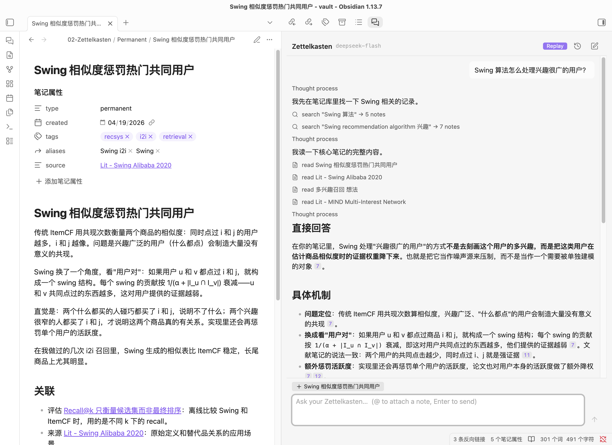

# Zettel Agent

**Ask your Zettelkasten anything, inside Obsidian.** A read-only research agent that searches, reads and follows links across your notes, and answers with citations to the exact sections it read.



_The agent searches (in Chinese, then again in English), reads four notes, and answers with numbered citations. Each chip opens the section it cites. The open note is offered as context with one click._

Zettel Agent is a thinking partner for a Zettelkasten (Fleeting, Literature, Permanent and Writing notes). It is **read-only by construction**: it has no tool that can change a file. It critiques and questions your drafts instead of writing them for you, because Zettelkasten notes are meant to be in your own words. Text reaches a note only when you copy or insert it yourself.

> **Status:** v0.1, desktop only. Verified end to end with DeepSeek Flash, Claude Haiku 4.5 and GPT-6 Luna. You bring your own API key.

## Features

- **Cited answers.** Every claim cites the note section it rests on as a numbered chip, and clicking the chip opens that section. Citations are checked against what the agent actually read; an invented citation is flagged.
- **Agentic retrieval.** The agent decides what to search, which notes to read and which links to follow. Its tools are search, exact match, read, link neighbourhood and list, and each step appears as a line you can expand.
- **Bilingual.** Retrieval handles Chinese and English. When a search in one language finds nothing, the agent tries the other, so a Chinese question can find English notes.
- **Honest about gaps.** When your notes do not cover something, the agent says so and does not pad the answer with weak matches.
- **Context from Obsidian.** Type `@` to attach any note. The open note, and text you have selected in editing or reading view, are offered as one-click chips.
- **Saved chats.** Chats are saved after every answer and can be reopened from History, with working citations and the model context intact. You can retry the last question or stop an answer with Esc.
- **Copy and insert.** Copy an answer, or insert it at your cursor; either way citations become `[[Note#Heading]]` links.
- **Choice of model.** Claude, OpenAI (Responses API) or DeepSeek, selected in settings. Each provider defaults to its cheapest model, and a stronger one can be picked. Each model provider has its own API key, kept in Obsidian's secret storage.
- **Offline mode.** Record answers once, then replay them with no network and no cost, for demos and interface work.

## Design

```text
Question ──▶ ChatSession ──▶ agent loop (own code) ──▶ ModelProvider ──▶ Claude / OpenAI / DeepSeek
                 │                │   ▲
                 │                ▼   │ tool results, each section numbered [E1], [E2], …
                 │           read-only tools ──▶ Corpus: bilingual BM25 + Obsidian link graph
                 ▼
        saved chat (items, transcript, evidence)
```

- **A self-written agent loop instead of a framework** ([`agent/loop.ts`](src/agent/loop.ts)). It streams each turn and runs the requested tools. It enforces budgets on requests, tool calls and tool output, and nudges the model after rounds that surface nothing new. The last request is made without tools, so every turn ends in an answer. The transcript is append-only, which keeps prompt caching and reasoning replay valid.
- **One neutral message format, thin adapters per provider** ([ADR-0009](docs/adr/0009-multi-provider-adapters.md)). Each assistant message keeps the provider's raw output. That output is replayed verbatim to the same model, so Claude's thinking signatures, OpenAI's encrypted reasoning and DeepSeek's `reasoning_content` survive across tool calls.
- **Evidence ledger** ([`agent/evidence.ts`](src/agent/evidence.ts)). Every section a tool returns gets an id pinned to the note's content hash. Answers may cite only those ids.
- **Retrieval tuned for a Zettelkasten** ([`retrieval/`](src/retrieval)). BM25F scores at two levels: title, aliases and tags once per note, and headings, body and links per section. Results are collapsed to one per note. Tokenization combines `Intl.Segmenter` words with CJK bigrams, which recover domain terms the segmenter splits (双塔 → 双 | 塔). Links resolve exactly as Obsidian resolves them.
- **Read-only by construction** ([ADR-0008](docs/adr/0008-read-only-agent-own-loop.md)). Note text is wrapped as untrusted data, and the system prompt tells the model never to follow instructions found in notes. A prompt-injection note is part of the test vault.

More detail: [docs/architecture.md](docs/architecture.md), and the ADRs in [docs/adr/](docs/adr).

## Quality

**Retrieval evaluation** (`npm run eval`, no API calls): 35 judged bilingual queries over a synthetic 55-note fixture vault, scored at note level.

| Tokenizer           | Recall@5 | Recall@10 | MRR  | Recall@10 (zh) |
| ------------------- | -------- | --------- | ---- | -------------- |
| Segmenter words     | 81.2     | 92.9      | 89.3 | 88.7           |
| CJK bigrams         | 77.9     | 89.5      | 84.8 | 83.9           |
| **Words + bigrams** | **82.4** | **93.8**  | 88.8 | **91.1**       |

The main miss for lexical search is a Chinese question whose answer is only in English notes. The agent covers that case by searching again in the other language.

**Tests.** They run from cheap to live:

| Layer                                              | What it covers                                                                                                                                                      | Cost                    |
| -------------------------------------------------- | ------------------------------------------------------------------------------------------------------------------------------------------------------------------- | ----------------------- |
| `npm test`: 145 unit tests                         | Retrieval, loop, tools, adapters (including recorded provider streams), session                                                                                     | free                    |
| Replay tests (part of `npm test`)                  | 10 real DeepSeek conversations replayed through the real SDK, adapters, loop and tools, offline                                                                     | free                    |
| `npm run e2e`: 25 tests ([details](e2e/README.md)) | The plugin inside a real Obsidian window, driven over the DevTools protocol: nine question scenarios plus clicks, attachments, history, retry, stop, offline replay | a few cents on DeepSeek |

In end-to-end runs on DeepSeek Flash, answers cited 88–100% of the expected notes across the nine scenarios. Those scenarios include multi-hop questions, cross-lingual questions, no-answer questions, a prompt injection and a request to ghostwrite a note.

## Install (from source)

The plugin is not in the community store yet.

```bash
git clone https://github.com/daniellaah/zettel-agent.git && cd zettel-agent
npm install
OBSIDIAN_PLUGIN_DIR="/path/to/your-vault/.obsidian/plugins/zettel-agent" npm run build
```

Then enable **Zettel Agent** under _Settings → Community plugins_. In its settings, choose a model provider, add that provider's API key, and set the Zettelkasten folder (for example `02-Zettelkasten`) and the names of your stage folders. Open the chat from the ribbon or with the command _Zettel Agent: Open chat_.

## Offline mode

_Settings → Offline mode_: **Record** saves each question's model responses to the plugin folder. **Replay** answers recorded questions with no network and no API key. Replay runs the real SDKs, loop and tools, so the interface behaves exactly as it does live ([ADR-0010](docs/adr/0010-offline-record-replay.md)).

## Privacy

Your questions, and the note excerpts the agent reads, go to the model provider you choose. The search index, saved chats and recordings stay in your vault's plugin folder. API keys stay in Obsidian's secret storage and are never written to recordings. OpenAI requests use `store: false`.

## Development

```bash
npm run check    # typecheck, lint, format check, unit tests
npm run eval     # retrieval quality on the fixture vault
npm run e2e      # the plugin in Obsidian against live APIs (macOS; costs a few cents)
npm run dev      # rebuild on change; set OBSIDIAN_PLUGIN_DIR to copy into a vault
```

```text
src/
  retrieval/  parsing, tokenizer, BM25F index, link graph, corpus        (plain TypeScript)
  agent/      loop, tools, evidence, prompt, provider adapters, recording (plain TypeScript)
  session/    chat state, saving, retry, attachments                    (plain TypeScript)
  vault/      Obsidian adapters: vault index, chats, recordings
  ui/         React chat view, composer, history, settings
fixtures/     synthetic bilingual vault and recorded conversations
eval/         judged queries and the retrieval evaluation
e2e/          end-to-end tests that drive Obsidian
```

Only `vault/` and `ui/` import `obsidian`, so everything else runs and is tested in Node. See [AGENTS.md](AGENTS.md) for the working rules.

## Roadmap

- `/` commands for common workflows: suggest links, critique a draft, find gaps, outline.
- A link-suggestion view: candidate links with a relationship type and reason, one click to copy.
- Judged queries from a real vault, and the evaluation run across providers.
- Community-store release.

## License

MIT
