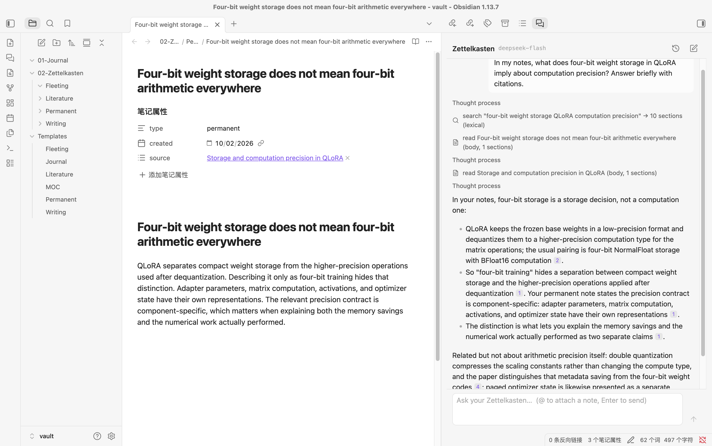
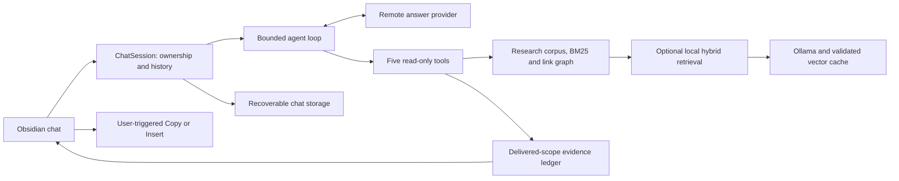

# Zettel Agent

**Ask questions across your Zettelkasten and inspect the notes behind the answer, inside Obsidian.** Zettel Agent is a read-only research assistant for literature, permanent and writing notes: finding an idea, comparing sources, tracing connections, or identifying gaps before writing in your own words.



_Actual macOS / Obsidian 1.13.7 on the synthetic fixture vault, with a real DeepSeek Flash answer from the bounded release smoke. It contains no personal notes or API keys. Basic acceptance is not an answer-quality benchmark._

**Public-test build 0.1.0 · Desktop only.** The prepared snapshot is ready for testing on **macOS / Obsidian 1.13.7 / DeepSeek Flash / BM25**. There is no published GitHub Release or community-directory entry yet. [Validation and limitations](docs/release-readiness.md).

## Why Zettel Agent

A growing note collection leaves a writer with work beyond finding a phrase: gathering sources, comparing claims and deciding how ideas connect. Zettel Agent makes that investigation visible beside the notes. The model selects its search and reading steps; you inspect the evidence and decide what belongs in your own writing.

## What you can do

- **Find an idea:** ask what your notes say about a topic and inspect the matching excerpts.
- **Compare sources:** investigate how two mechanisms or claims differ, with links back to their notes.
- **Follow connections:** examine linked ideas or gaps before developing a new piece of writing.
- **Keep control:** the agent only reads; you choose whether to Copy, Insert or create a note through a separate command.

## Quick start — no Ollama required

1. Install the plugin using the manual steps below. Enable **Zettel Agent** in **Settings → Community plugins**.
2. Open **Settings → Zettel Agent**. Set **Zettelkasten folder** to your vault-relative research folder, for example `02-Zettelkasten`, then match your stage-folder names (`Literature`, `Permanent`, `Writing`, `Fleeting`). A blank root includes the whole vault; choose a folder to limit research.
3. Choose **DeepSeek → DeepSeek Flash (`deepseek-flash`)**, the new-install default. Create a provider API key, then create/select its entry using the API-key secret selector. Chat subscriptions and Codex App sign-in do not supply an API key.
4. Keep **Search mode → BM25** and **Answer checks → Citation structure**. Neither needs a local model. Fleeting notes are excluded even when frontmatter changes their effective stage.
5. Use the chat ribbon button or **Zettel Agent: Open chat**. Ask a question such as “How do QLoRA paged optimizers differ from PagedAttention in my notes?” Type `@` to attach a note, or use the open-note/selection chips.
6. Expand search/read steps, inspect citation chips, and open the referenced source. Use **Copy** or **Insert at cursor** when you want to transfer an answer. Citations become vault-relative `[[path#heading]]` links.

The agent chooses its search terms and reading steps. BM25 matches words rather than meaning; paraphrases and cross-language questions can require another search in the source language. Missing research notes produce a setup message before a model request. Esc/Stop cancels a turn; you can send again, retry the last question or open another saved chat.

## Installation

Requirements: Obsidian **desktop 1.11.5 or newer**, a provider API key and research notes. The current fixture has been tested on **macOS / Obsidian 1.13.7**. Windows/Linux and the minimum-version build have not been tested separately; mobile is unsupported. [Compatibility rationale](docs/provider-compatibility.md).

Obtain the prepared test package from the maintainer; there is no published Release download yet. The package contains exactly `main.js`, `manifest.json` and `styles.css` inside a `zettel-agent/` folder:

1. Quit Obsidian or disable the existing plugin. Back up its settings/history before replacing an installation.
2. Extract/copy that folder to `<vault>/.obsidian/plugins/zettel-agent/` (use your actual configuration folder if it differs).
3. Restart Obsidian and enable it under Community plugins. Confirm the plugin settings and empty chat open, then configure a research folder and key.

To build from source, use Node 24 and npm:

```bash
git clone https://github.com/daniellaah/zettel-agent.git
cd zettel-agent
npm ci
npm run check
npm run release:package
```

The package, source-state manifest and SHA-256 checksums appear in a new `artifacts/releases/` directory. This is an untagged local snapshot, not a published version. `npm run build` writes only the repository bundle; it ignores an inherited `OBSIDIAN_PLUGIN_DIR`. Deliberate fixture copying requires `--copy-to-vault`:

```bash
OBSIDIAN_PLUGIN_DIR="/path/to/test-vault/.obsidian/plugins/zettel-agent" \
  node esbuild.config.mjs --production --copy-to-vault
```

See [installation and rollback details](docs/release-checklist.md).

## What the five tools do

| Tool     | What you can use it for                                           |
| -------- | ----------------------------------------------------------------- |
| `search` | Find relevant excerpts by words, or opt-in local hybrid retrieval |
| `match`  | Locate exact phrases or bounded patterns with line context        |
| `read`   | Read a note, heading or bounded continuation page                 |
| `links`  | Follow incoming/outgoing connections and inspect orphan notes     |
| `list`   | Survey research notes by stage, folder, tag or connection state   |

Tool output describes its scope, totals and whether more pages remain. Similarity, titles and link relationships do not by themselves support a body claim. The evidence ledger distinguishes delivered scopes and binds citations to source revisions. Unknown/undelivered/stale citations can be flagged; a valid ID is **not proof that a claim is true**.

Citation clicks open the exact existing source file. Deleted, renamed or inaccessible evidence produces a notice, without creating a note or choosing a same-named file. Changed sources open their current content with a warning. Ordinary note links also use non-creating opens; app-command/local-file URLs are disabled in chat.

## Models and cost

DeepSeek Flash is the first-test default. Anthropic Messages, OpenAI Responses (`store: false`) and DeepSeek Chat Completions adapters are implemented and tested offline. **DeepSeek `deepseek-flash` completed the eight frozen basic release scenarios**, with retained failures and targeted scenario-5 repairs. This applies to BM25 on macOS / Obsidian 1.13.7 and is not complete answer-quality validation. [API results](docs/release-api-results.md) disclose cost, scope and quality findings. Other combinations have not completed this release acceptance. The [provider table](docs/provider-compatibility.md) lists official API IDs and current validation status.

You pay the selected provider for questions, context, tool excerpts, reasoning and answers. The loop allows at most ten model requests per turn, with a reserved final answer, bounded tool calls/output and a conservative input window. DeepSeek has an 8192-token output ceiling per request, including thinking. SDK automatic retries are disabled; **Ask again** deliberately makes another turn.

**Evidence and coverage self-review (experimental)** can add up to three billed requests within the same ten-request limit: review, one revision and re-review. It buffers drafts, permits limited targeted research, and withholds a failed review's draft while retaining the audit. It uses the **same model** and is fallible; this is not independent verification or a demonstrated answer-quality improvement. Structural checks remain the default.

## Local hybrid retrieval (optional)

BM25 is usable without Ollama. If you already use [Ollama](https://ollama.com), the experimental option uses `qwen3-embedding:0.6b` (1024 dimensions). Installing that optional model is your choice:

```bash
ollama pull qwen3-embedding:0.6b
```

In **Local retrieval**, select **Local hybrid (experimental)**. The endpoint defaults to `http://127.0.0.1:11434`; only loopback HTTP origins are accepted. Use **Refresh status**, then **Build / retry** if needed. A missing service/model, changed model digest or stale index is disclosed and falls back to BM25. Replay makes no local embedding requests.

The host encodes research sections locally, pins the model digest, reuses valid section vectors and updates derived data on note changes. Agent tools cannot build/write the cache. Hybrid fuses bounded BM25 and dense candidates using reciprocal rank fusion; it is still experimental and not the default. Local processing does not make live answer generation local.

## Privacy, storage and authorship

In live chat, your question, selected text, active-note context, attached/read note excerpts and retained conversation context are sent to the selected remote answer provider. Tools run locally; they deliver bounded fragments, but multiple requests can collectively disclose substantial research content. Optional self-review sends its draft and delivered evidence to that same provider. OpenAI `store: false` is an API option, not a promise of zero provider retention; consult your provider's data policy.

Ollama receives section representations (titles, headings, bodies) and search queries at the configured loopback endpoint. The embedding cache contains plaintext representations and vectors, outside the vault. The service may also keep a local model in memory. Hardware/electricity costs are not measured.

| Data                                         | Location                                                                                                      |
| -------------------------------------------- | ------------------------------------------------------------------------------------------------------------- |
| Plugin settings and secret **IDs**           | `<vault>/<config-dir>/plugins/zettel-agent/data.json`                                                         |
| Actual API-key values                        | Obsidian's shared SecretStorage/Keychain, accessed by secret ID; not stored by this plugin in `data.json`     |
| Chats, transcript, evidence and review audit | Plugin directory `conversations/`; `.pending`, `.bak`, `.deleted` files support recovery/deletion             |
| New model HTTP recordings                    | Plugin directory `recordings/v2/<provider>/`, separate files per run; request bodies/responses, never headers |
| Historical recordings                        | Existing `recordings/` files retained; unbound v1 is for historical SDK tests, not automatic plugin replay    |
| BM25 index and query-vector cache            | In memory                                                                                                     |
| Persistent section-vector cache              | OS cache directory `zettel-agent/embeddings/v1/<vault-root-hash>/`                                            |

Default embedding cache roots: `~/Library/Caches` on macOS, `$XDG_CACHE_HOME` or `~/.cache` on Linux, `~/AppData/Local` on Windows. Chats, recordings and backups contain note excerpts and are not encrypted by this plugin. Keep them private; vault backups/sync may include the plugin directory.

Obsidian 1.11.5 documents encrypted SecretStorage on disk. The plugin delegates storage protection to Obsidian and the OS; it does not guarantee encryption when the host's keychain is unavailable. See [official secret storage](https://docs.obsidian.md/plugins/guides/secret-storage) and [1.11.5 changes](https://obsidian.md/changelog/2026-01-20-desktop-v1.11.5/).

The agent has five **read-only** tools and no note-writing capability. Only your explicit **Insert at cursor**, pasted **Copy**, or fixed-template **Create note** command writes note content. User-created fleeting/literature/permanent notes use fixed scaffolds without model calls and do not overwrite existing files. Notes, metadata and model output remain untrusted data; escaping and scope checks reduce injection paths but do not guarantee semantic attack resistance.

## Offline replay and recovery

Record mode saves model HTTP traffic. Replay requires a matching research corpus, BM25 retrieval, answer-check mode and exact request/history/evidence sequence. It uses the real SDK parsers, loop and tools with **zero network**. Changed context, hybrid rankings or incompatible old recordings are rejected with a message; it does not silently attach an old answer to different sources. Keep historical recordings unchanged and record a new run when the protocol changes.

History lists recoverable chats even when another file is damaged. Pending writes and backups are retained; an interrupted turn reopens as stopped. Save/load failures show a message. Recovery files are not an alternative to backups, and adapter rename/recovery is not a guarantee against disk failure.

## Troubleshooting

| Symptom                        | Check                                                                                          |
| ------------------------------ | ---------------------------------------------------------------------------------------------- |
| “Add your … API key”           | Create/select the provider's secret entry; check the chosen provider                           |
| No research notes              | Root/stage-folder spelling, indexing, effective frontmatter stage; fleeting is excluded        |
| Model/API rejection            | Use a public API ID from your provider; verify key access/balance; retry after fixing settings |
| Network/rate limit error       | Check connection/provider status; Stop and retry deliberately                                  |
| Local index unavailable        | Ollama running, model installed, loopback endpoint; BM25 remains usable                        |
| Replay refused/no recording    | Same question/history/corpus/check mode and BM25; record a new bound session                   |
| Changed/missing citation       | Inspect current note or retrieve it again; rename/delete never creates a replacement           |
| Chat could not be saved/loaded | Plugin-folder permissions/free disk space; retain `.pending`/`.bak` for recovery               |
| Long question stops early      | Narrow the request; full saved history remains, older request turns may be omitted             |
| Self-review fails              | Inspect its retained audit, narrow/retry; it is experimental and can fail closed               |

## Architecture and design

The core is a bounded agent loop with five research tools and a delivered-scope evidence ledger. Retrieval, agent and session remain plain TypeScript, testable in Node; only UI/vault adapters import Obsidian. Tool results and source revisions connect the model's research to inspectable citations.



Each turn owns cancellation and checks its identity before updating the UI, history or evidence. Host storage serializes immutable snapshots and retains recoverable pending files/backups. Recorded requests replay through the actual SDK and tools; corpus, mode or request mismatches fail without a network fallback.

The loop reserves input space for final synthesis and ends expansion on an output-budget rejection. Its final control asks for scoped missing-evidence claims and disclosure of incomplete searches. Full saved history stays intact, while individual requests select complete older turns to fit the input window. These boundaries support a recoverable research workflow; they do not certify the correctness of every generated sentence.

## Verified scope and next steps

The following results describe the prepared 0.1.0 snapshot and its synthetic fixture, checked on 2026-10-03:

| Check                | Result                                                          | Scope                                                                                                                              |
| -------------------- | --------------------------------------------------------------- | ---------------------------------------------------------------------------------------------------------------------------------- |
| Engineering          | 363 tests / 63 files pass; TypeScript, ESLint and Prettier pass | Offline retrieval contracts, lifecycle, storage and provider mechanics                                                             |
| Installed-package UI | 10 checks / 5 files pass                                        | macOS / Obsidian 1.13.7, installation and core UI/recovery flows                                                                   |
| Real API acceptance  | Eight frozen primary criteria pass                              | DeepSeek Flash, BM25; lookup, synthesis, follow-up, Chinese query, insufficient evidence, cancellation, errors and optional review |
| Strict replay        | All eight final primary outputs reproduced; zero network        | Actual SDK/tool flows, matching history and source evidence                                                                        |
| Local cache          | Warm build reuses 318/318 sections without re-encoding          | Installed local Qwen model, hybrid and unavailable-service fallback                                                                |

Two missing-evidence attempts failed before targeted repairs; both remain recorded. The final smoke still includes ancillary wording, citation-format and verbosity findings. Structural citation validity and same-model review are not independent factual verification. The [API report](docs/release-api-results.md) and [source inspection](docs/release-source-review.md) preserve those boundaries.

Next steps are a fresh final answer-quality suite and independent human calibration, more provider/platform smoke, minimum-version testing, larger-vault memory/incremental measurements and contributor materials. Hybrid/review defaults remain experimental until their quality gates pass. Semantic retrieval, slash workflows and link suggestions are later options; ANN or a planner requires a measured need. Public Release and community-directory submission have not been performed.

## Development and evidence

```bash
npm run check           # typecheck, ESLint, Prettier, offline unit/SDK tests
npm run build           # production bundle, no implicit vault copy
npm run release:package # local three-file installable snapshot + source hashes
npm run eval            # frozen retrieval regression, no model APIs
npm run eval:agent      # free mechanics smoke by default
npm run eval:full       # free mechanics smoke by default; paid runs need explicit opt-in
npm run dev -- --copy-to-vault # optional explicit destination via OBSIDIAN_PLUGIN_DIR
```

Targeted fixture E2E is macOS-only and restarts Obsidian. This command is free, uses scripted answer providers and an already-installed local model/cache, and never downloads a runtime/model:

```bash
npm run e2e -- e2e/plugin.e2e.ts e2e/release-safety.e2e.ts \
  e2e/release-assets.e2e.ts e2e/release-local.e2e.ts e2e/answer-review.e2e.ts
```

Default `npm run e2e` includes live provider tests and costs money. See [E2E guide](e2e/README.md), [bounded live protocol](docs/release-live-protocol.md) and [readiness evidence](docs/release-readiness.md).

The fixture/evaluation reports contain synthetic AI annotations and limited samples, **not independent human gold or a production guarantee**. Historical retrieval/local-hybrid results measure their bound corpora/protocols; retrieval gains do not establish better generated answers. Full paired answer evaluation, a fresh complete quality gate and independent human calibration are pending. See [local quality results](docs/local-retrieval-quality-results.md), [Agentic RAG mechanics](docs/agentic-rag-results.md) and [evaluation guide](eval/README.md).

Further engineering records: [architecture overview](docs/architecture.md), [ADRs](docs/adr/) and [P1/P2 roadmap](docs/release-readiness.md#deferred-roadmap).

## License

[MIT](LICENSE). Copyright © 2026 Bo Gao. The manifest and license credit Bo Gao; verified repository history is authored as Gao Bo. Release-safety preparation was developed with Codex assistance.
