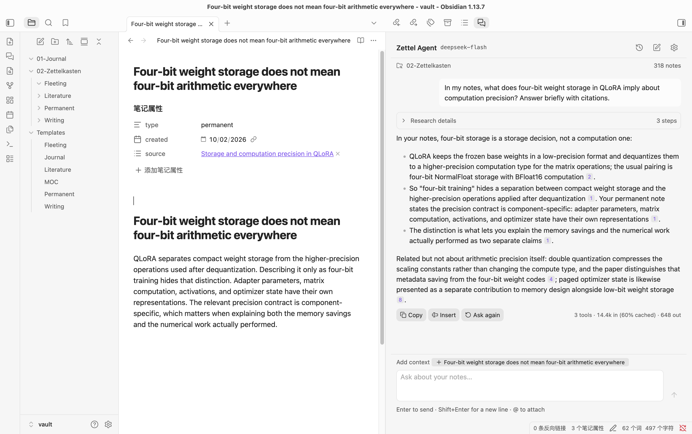
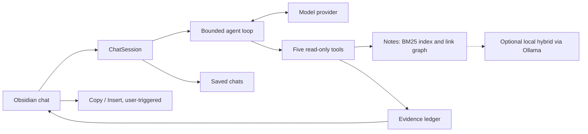

# Zettel Agent

**Ask your Zettelkasten anything, and check every answer against your own notes.**

Zettel Agent is a read-only research agent for [Obsidian](https://obsidian.md). It searches, reads and follows links across your literature, permanent and writing notes, then answers with citations that open the exact note section each claim came from.



<sub>Asking about QLoRA: each numbered citation opens the note it came from. Captured on a sample vault.</sub>

> [!NOTE]
> **0.1.0 public test · desktop only.** So far it has been tested on macOS with DeepSeek Flash. There is no GitHub Release or community-plugin listing yet, so [install it manually](#install).

## Why

A plain search finds a phrase. Writing from a Zettelkasten takes more work than that: you gather sources, compare claims, trace how ideas connect and spot what is missing. Zettel Agent does that legwork in a sidebar next to your notes. The model decides what to search and read. You can see each step it took and each excerpt it relied on, and you decide what goes into your own writing.

Typical questions:

- _What do my notes say about paged optimizers?_ Find an idea and the excerpts behind it.
- _How does QLoRA's paging differ from PagedAttention?_ Compare two sources or mechanisms.
- _What links to my note on reward models, and what is still missing?_ Follow connections and find gaps before you write.

## Features

- **An agent loop instead of a fixed pipeline.** The model picks from five read-only tools (`search`, `match`, `read`, `links`, `list`). It keeps going until it has enough evidence or reaches its budget.
- **Citations you can verify.** Each excerpt the agent reads gets an evidence ID tied to that note's content hash. Click a citation chip to open the exact section. The answer flags citations to text the agent never received and to notes that have changed since it read them.
- **Read-only by design.** The agent has no write tool. Text reaches your vault only when you press **Copy** or **Insert**, which turn citations into `[[path#heading]]` links, or when you create a note from a fixed template.
- **Your own model and key.** Works with DeepSeek (the default), Anthropic Claude and OpenAI. Keys stay in Obsidian's SecretStorage.
- **English and Chinese.** BM25 search understands CJK text. Optional local hybrid retrieval through Ollama helps with paraphrased and cross-language questions.
- **Chat basics.** Type `@` to attach a note, or add the open note or a selection with one click. Chats are saved, **Ask again** retries the last question, and **Esc** stops a running turn.
- **Offline record and replay.** You can record a session's model traffic and replay it later through the real SDK, agent loop and tools, without touching the network.

## Install

You need Obsidian **desktop 1.11.5 or newer**, an API key from a supported provider, and a folder of notes. Mobile is not supported.

**From a test package.** The package is a `zettel-agent/` folder containing `main.js`, `manifest.json` and `styles.css`. Ask the maintainer for one.

1. Quit Obsidian. If you are upgrading, back up the plugin folder first.
2. Copy the folder to `<vault>/.obsidian/plugins/zettel-agent/`.
3. Restart Obsidian and enable **Zettel Agent** under **Settings → Community plugins**.

**From source** (Node 24):

```bash
git clone https://github.com/daniellaah/zettel-agent.git
cd zettel-agent
npm ci
npm run check
npm run release:package   # writes the package and SHA-256 checksums to artifacts/releases/
```

To build straight into a test vault:

```bash
OBSIDIAN_PLUGIN_DIR="/path/to/vault/.obsidian/plugins/zettel-agent" \
  node esbuild.config.mjs --production --copy-to-vault
```

More detail, including rollback, is in the [release checklist](docs/release-checklist.md).

## Quick start

No local model is required.

1. Open **Settings → Zettel Agent**.
2. Under **Model connection**, keep **DeepSeek → DeepSeek Flash** or pick another provider, then create or select its **API key** entry. A chat subscription such as ChatGPT or Claude.ai does not give you an API key.
3. Under **Research scope**, set **Zettelkasten folder** to your notes folder, for example `02-Zettelkasten`. Leave it blank to include the whole vault. If your sub-folders are not named `Literature`, `Permanent`, `Writing` and `Fleeting`, rename them under **Advanced settings → Note folders**. Fleeting notes are never searched.
4. Open the chat from the ribbon icon or the **Zettel Agent: Open chat** command, then ask something like _"How do QLoRA paged optimizers differ from PagedAttention in my notes?"_

The chat header shows your research folder and how many notes are indexed. **Research details** is folded by default. Expand it to see each search and read step. Click a citation, or focus it and press Enter, to open the source.

> [!TIP]
> BM25 matches words, not meaning. If a paraphrased or cross-language question comes back thin, ask again using the wording of your notes, or turn on [local hybrid retrieval](#local-hybrid-retrieval-optional).

## How it works



Each question runs one **turn** of a bounded loop. The model calls tools, reads the results and decides whether to keep researching. A turn allows at most 10 model requests, 30 tool calls and 120k characters of tool output. The last request is reserved for writing the answer, with tools turned off.

| Tool     | What it does                                                         |
| -------- | -------------------------------------------------------------------- |
| `search` | Ranked excerpts by keyword (BM25F), or local hybrid when enabled     |
| `match`  | Exact phrases or bounded patterns, with line context                 |
| `read`   | A whole note, one heading, or the next page of a long section        |
| `links`  | Incoming and outgoing links, one or two hops away, plus orphan notes |
| `list`   | Notes by stage, folder, tag or link status, with optional previews   |

Every section a tool returns is registered in an **evidence ledger** with an ID (`E1`, `E2`, …) tied to the note's content hash. The answer cites those IDs inline, and the UI turns them into clickable chips. A valid citation shows the agent actually received that text. It does not prove the claim is correct, which is why the chips are there for you to check.

Retrieval, the agent loop and session code are plain TypeScript that run and are tested in Node. Only the UI and vault adapters import Obsidian. For the full design, see [architecture](docs/architecture.md) and the [ADRs](docs/adr/).

## Models

| Provider           | Models in the picker                                       |
| ------------------ | ---------------------------------------------------------- |
| DeepSeek (default) | `deepseek-flash`, `deepseek-v4-pro`                        |
| Anthropic Claude   | `claude-haiku-4-5`, `claude-sonnet-5-5`, `claude-opus-5-5` |
| OpenAI             | `gpt-6-luna`, `gpt-6.1-sol`, `gpt-6-astra`                 |

You can also type any other model ID. You pay your provider for each request. Automatic retries are off, so a question is only re-sent when you press **Ask again**. See [provider compatibility](docs/provider-compatibility.md).

**Evidence and coverage self-review** (experimental, under **Advanced settings → Answer checks**) has the same model review its draft for unsupported claims and revise it once before you see it. It costs extra requests and is not independent verification. The default is a structural citation check.

## Local hybrid retrieval (optional)

If you already run [Ollama](https://ollama.com), you can add semantic search on your own machine:

```bash
ollama pull qwen3-embedding:0.6b
```

Then open **Advanced settings → Local retrieval**, set **Search mode** to **Local hybrid (experimental)**, and click **Build / retry**. The plugin embeds your note sections locally, caches the vectors outside the vault, and merges BM25 and dense results with reciprocal rank fusion. If Ollama is down, the model changes or the index is stale, the chat says so and falls back to BM25. Only loopback addresses are accepted.

Hybrid search helps most with paraphrased questions and with questions asked in a different language from your notes. It is still experimental, so BM25 stays the default.

## Privacy and data

**Sent to your model provider:** your question, any attached or selected text, the open note's context, the excerpts the agent reads and earlier turns of the chat. Each tool returns bounded excerpts, but a long research turn can still send a lot of your notes. Check your provider's data policy. OpenAI requests use `store: false`, which is an API option and not a guarantee of zero retention.

**Sent to Ollama, if enabled:** note sections and search queries, over loopback only.

| Data                          | Where it lives                                                                  |
| ----------------------------- | ------------------------------------------------------------------------------- |
| Settings and secret **IDs**   | `<vault>/.obsidian/plugins/zettel-agent/data.json`                              |
| API key values                | Obsidian SecretStorage / OS keychain, never in `data.json`                      |
| Saved chats and evidence      | Plugin folder `conversations/`                                                  |
| Recordings (Record mode only) | Plugin folder `recordings/v2/<provider>/`: request and response bodies, no keys |
| BM25 index                    | Memory only                                                                     |
| Embedding cache (hybrid only) | OS cache directory `zettel-agent/embeddings/v1/<vault-hash>/`                   |

Saved chats, recordings and the embedding cache contain note text and are not encrypted by the plugin. Vault sync and backups may include the plugin folder. Note contents are treated as untrusted data and are never followed as instructions.

## Troubleshooting

| Symptom                           | Check                                                                         |
| --------------------------------- | ----------------------------------------------------------------------------- |
| "Add your … API key"              | Create or select the secret entry for the chosen provider                     |
| No research notes found           | Folder spelling, stage-folder names, frontmatter `type`; fleeting is excluded |
| Model or API rejected             | Use a real API model ID; check key access and balance                         |
| Network or rate-limit error       | Check your connection and provider status, then press **Ask again**           |
| Local index unavailable           | Ollama is running, the model is pulled, the address is loopback               |
| Citation opens a changed note     | The note was edited after the answer; check the current text                  |
| Citation says the note is missing | It was renamed or deleted; the plugin never creates a replacement             |
| Replay refused                    | The question, history, notes or settings differ from the recording            |
| Chat could not be saved           | Plugin folder permissions and free disk space; keep `.pending` / `.bak` files |

## Development

```bash
npm run check                  # typecheck, ESLint, Prettier, unit tests (all offline)
npm run build                  # production bundle
npm run dev -- --copy-to-vault # watch mode into $OBSIDIAN_PLUGIN_DIR
npm run eval                   # retrieval regression on the fixture, no model calls
npm run eval:agent             # agent mechanics smoke, free by default
```

End-to-end tests drive the real plugin inside Obsidian on the fixture vault. They are macOS-only and restart Obsidian. The targeted set below uses scripted model responses and costs nothing:

```bash
npm run e2e -- e2e/plugin.e2e.ts e2e/release-safety.e2e.ts \
  e2e/release-assets.e2e.ts e2e/release-local.e2e.ts e2e/answer-review.e2e.ts
```

Plain `npm run e2e` includes live provider tests and **costs money**. See the [E2E guide](e2e/README.md) and the [evaluation guide](eval/README.md). Contributors should read [AGENTS.md](AGENTS.md) for the hard rules: the agent stays read-only, and only `src/ui/` and `src/vault/` may import `obsidian`.

```text
src/
  retrieval/   sections, BM25F, CJK tokenizer, link graph, local vectors
  agent/       loop, tools, evidence ledger, prompts, provider adapters
  session/     chat state, saved chats
  vault/       read-only port over the Obsidian API
  ui/          React chat view, settings, note templates
```

## Roadmap

- [ ] `/` commands for writing: `/link`, `/critique`, `/gaps` and `/outline`
- [ ] A persistent index for faster startup on large vaults
- [ ] Testing with Claude and OpenAI, and on Windows and Linux
- [ ] An answer-quality evaluation with human review
- [ ] A GitHub Release and community-plugin submission

What has been tested so far is recorded in [release readiness](docs/release-readiness.md).

## License

[MIT](LICENSE) © 2026 Bo Gao. Release preparation was done with help from Codex.
