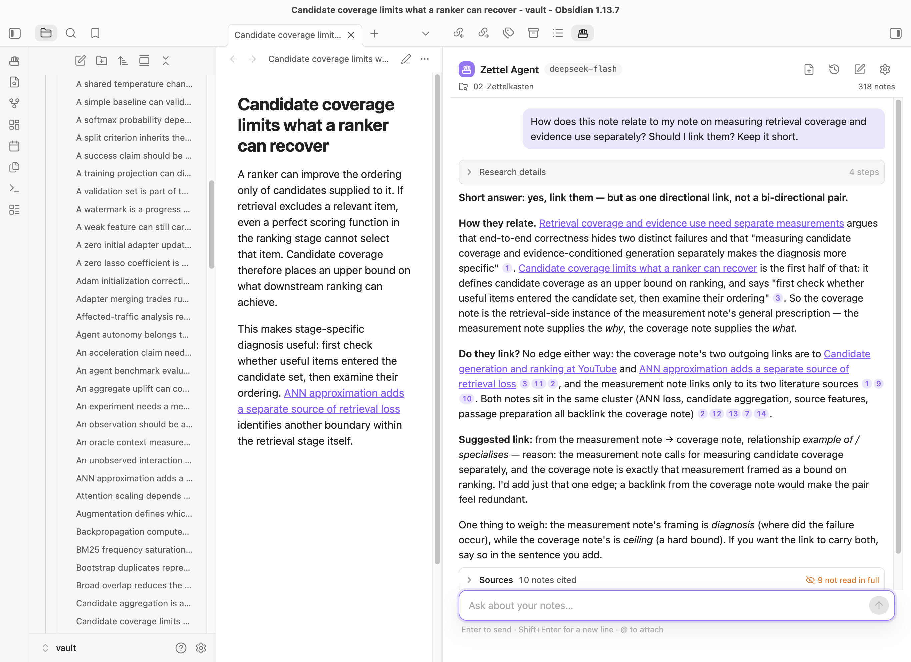
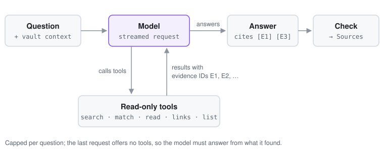

# Zettel Agent

An Obsidian plugin that helps you think with your notes and build a Zettelkasten.



## Usage

Build the plugin (Node 24) and copy it into your vault:

```bash
git clone https://github.com/daniellaah/zettel-agent.git
cd zettel-agent
npm ci && npm run build

VAULT=~/path/to/your/vault
mkdir -p "$VAULT/.obsidian/plugins/zettel-agent"
cp main.js manifest.json styles.css "$VAULT/.obsidian/plugins/zettel-agent/"
```

Optional, for search by meaning across languages:

```bash
brew install ollama
brew services start ollama
ollama pull bge-m3
```

In Obsidian:

1. **Settings → Community plugins**: enable Zettel Agent.
2. **Settings → Zettel Agent**: choose a provider, add its API key, and set your Zettelkasten folder.
3. Open the chat from the ribbon and ask a question.

| Provider  | Models                                               |
| --------- | ---------------------------------------------------- |
| DeepSeek  | DeepSeek Flash (default), DeepSeek V4 Pro            |
| Anthropic | Claude Opus 5.5, Claude Sonnet 5.5, Claude Haiku 4.5 |
| OpenAI    | GPT-6.1 Sol, GPT-6 Astra, GPT-6 Luna                 |

Any other model ID from these providers can be entered too.

## How it works

### Agent loop



Each question runs a tool-use loop. The model calls read-only tools until it can answer; every section a tool returns gets an evidence ID, and the answer cites those IDs. The plugin then checks that each cited ID was really shown to the model. Each question has a request budget, and the last request offers no tools, so the model must answer from what it found.

### Tools

| Tool     | Core                                  |
| -------- | ------------------------------------- |
| `search` | BM25F + bge-m3 embeddings (hybrid)    |
| `match`  | Exact text or regex, line by line     |
| `read`   | A note's body, outline or one section |
| `links`  | Backlinks and outgoing links          |
| `list`   | Filtered survey, e.g. orphan notes    |

### Project structure

```text
src/
├── agent/
│   ├── loop.ts         # tool-use loop and budgets
│   ├── prompt.ts       # system prompt
│   ├── tools/          # search, match, read, links, list
│   └── providers/      # Anthropic, OpenAI, DeepSeek
├── retrieval/          # BM25F, embeddings, hybrid fusion
├── session/            # chat history and saved chats
├── vault/              # keeps the index in sync with the vault
└── ui/                 # chat view, sources, settings
eval/                   # offline retrieval evaluation
e2e/                    # end-to-end tests in Obsidian
fixtures/vault/         # sample vault for tests
```

## License

[MIT](LICENSE)
